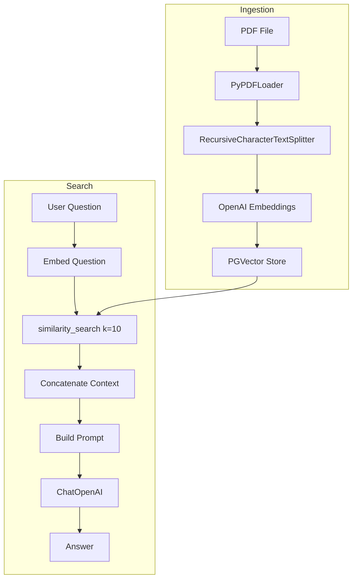

# Architecture

This document describes the architecture of the Grounded PDF RAG CLI system.

## Overview

The application is a CLI-based RAG (Retrieval-Augmented Generation) system that:

1. Ingests PDF documents into a PostgreSQL database with pgvector
2. Allows users to ask questions via the terminal
3. Answers questions using only the content from the ingested PDF (grounded QA)

## Data Flow

## Component Overview

### Entry Points

| Script | Responsibility |
|--------|----------------|
| `src/ingest.py` | PDF ingestion: load, split, embed, store |
| `src/search.py` | Similarity search and QA chain factory |
| `src/chat.py` | Interactive CLI loop |

### Core Modules

| Module | Responsibility |
|--------|----------------|
| `config` | Environment loading, validation, connection string |
| `prompts` | Grounded QA prompt template |
| `db` | PGVector store creation and document storage |
| `embeddings` | OpenAI embedding model factory |
| `llm` | ChatOpenAI model factory |
| `utils` | Project root, default PDF path |
| `exceptions` | Custom exception hierarchy |

### External Dependencies

- **LangChain**: Document loading, text splitting, embeddings, vector store, LLM
- **PostgreSQL + pgvector**: Vector storage and similarity search
- **OpenAI**: Embeddings (text-embedding-3-small) and chat (gpt-4o-mini)

## Key Design Decisions

1. **Grounded answers only**: The prompt enforces that the LLM responds only from the retrieved context. Unknown questions receive a fixed fallback response.

2. **Idempotent ingestion**: By default, the collection is cleared before each ingestion run to avoid duplicate embeddings.

3. **Config validation**: API key and optional path validation run at startup to fail fast with clear errors.

4. **Modular structure**: Each concern (config, embeddings, db, prompts) lives in a separate module for testability and clarity.
